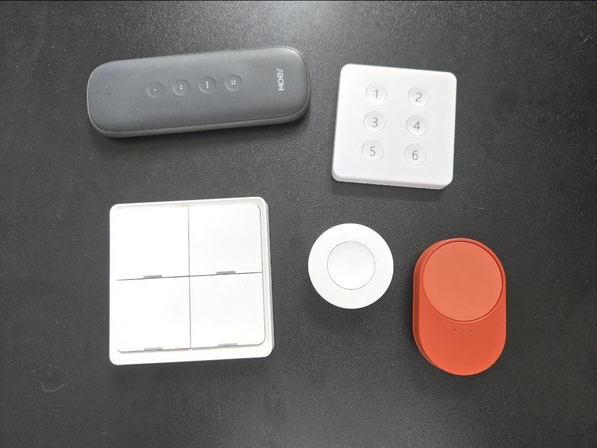
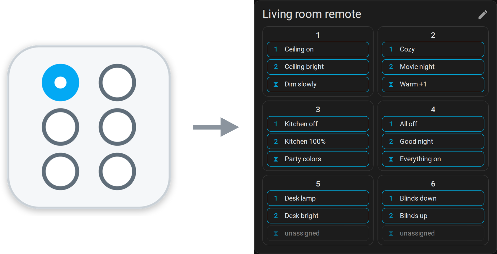
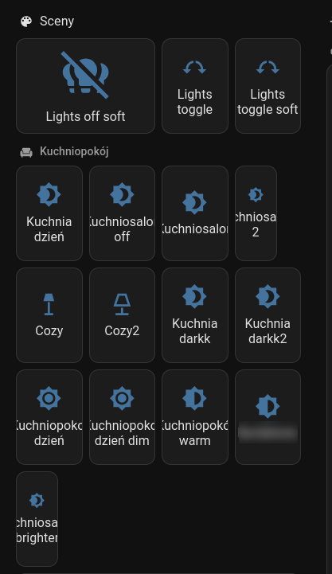
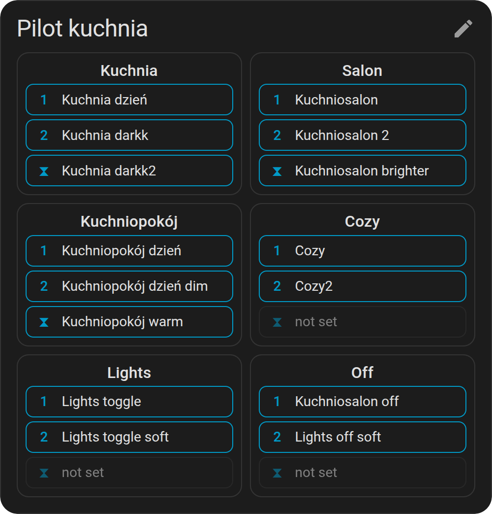
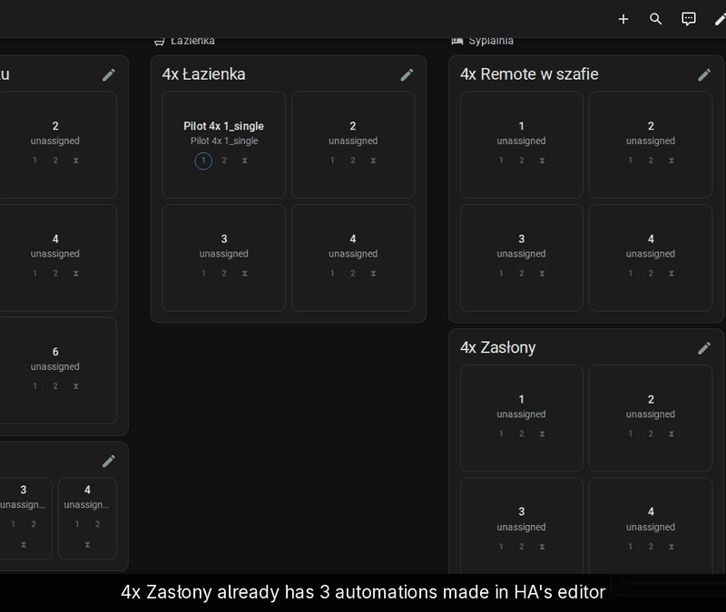
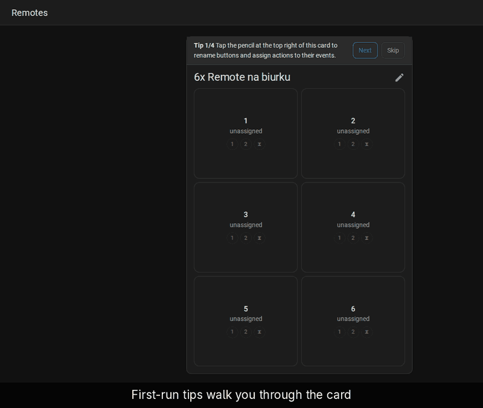
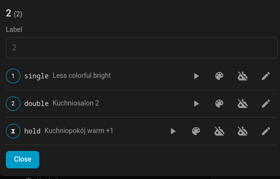
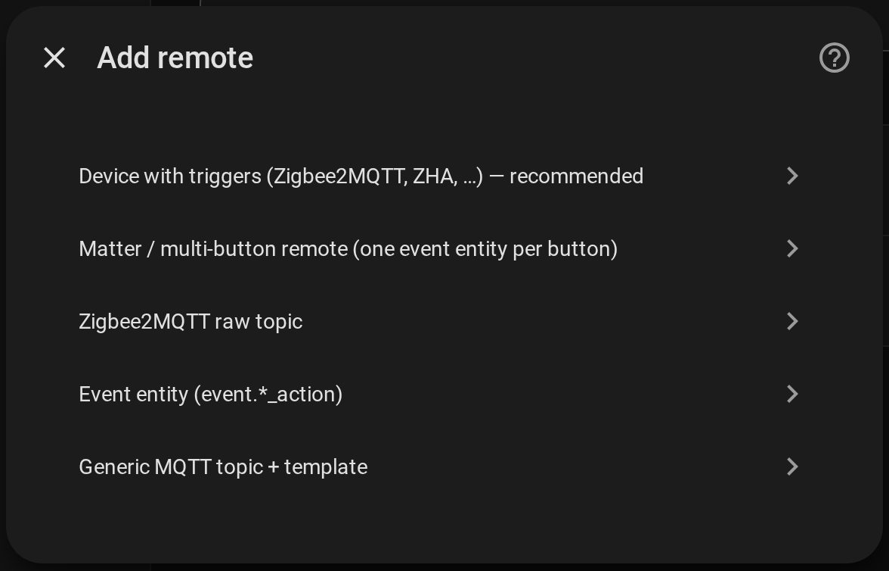
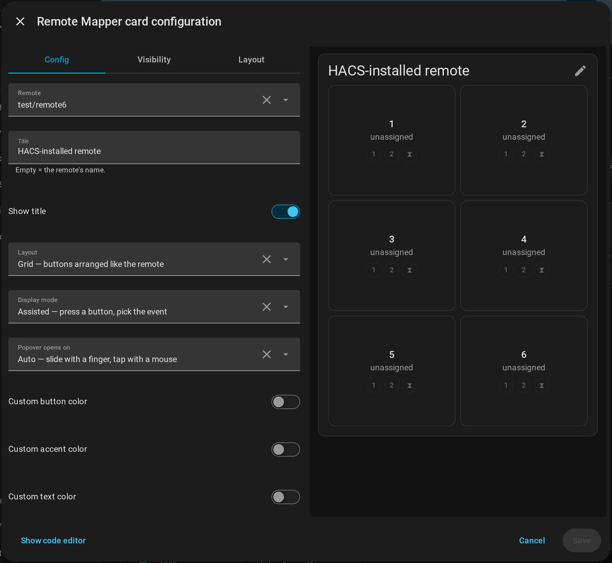
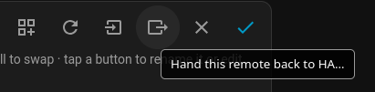

<div align="center">

# Remote Mapper for Home Assistant

**Turn any Zigbee / Matter / MQTT remote into a card that looks like the
remote — and assign what each button does right there, on the dashboard.**

[Features](#what-you-get) •
[Supported remotes](#supported-remotes) •
[Install](#install) •
[Guides (GIFs!)](#guides) •
[Card options](#card-options) •
[Leaving](#leaving)

</div>

🎬 **Prefer watching to reading?** The [guides](docs/guides/README.md) show
every step as a short screen recording: adding a remote, assigning buttons,
capturing scenes, importing your existing automations.

> [!TIP]
> **Never installed a HACS integration that ships its own dashboard card?**
> Watch [Getting started](docs/guides/getting-started.md) before you begin.
> The integration and the card are added in two different places, and the
> card is only listed under *By card*.

No blueprints, no one-automation-per-button, no YAML hunting. Pick the
button, pick the action, done. Everything else (automations, scenes, the
device's quirks) is handled for you. Works with any remote Home Assistant
can hear — Zigbee (Zigbee2MQTT, ZHA), Matter, plain MQTT, event entities —
one card, whatever the radio.



<p align="center">
  
</p>

## Why

Remotes are the best input device in a smart home and the worst to set up.
Every button × press type is a separate trigger, so a 6-button remote with
single/double/hold is 18 automations — or one giant `choose`. Six months
later nobody remembers what button 4 does.

Remote Mapper gives each remote **one card**, arranged like the real
device, where every button shows what it does and lets you change it.

<table>
  <tr>
    <th>Before: one dashboard tile per scene</th>
    <th>After: the same scenes on one remote card</th>
  </tr>
  <tr>
    <td></td>
    <td></td>
  </tr>
</table>

## What you get

- **A card shaped like the remote.** A Word-style picker sets the grid
  (2×3, 1×4, …); drag buttons into place; rename them. Saved with the
  remote, so every dashboard shows the same layout.

  <!-- screenshot: edit mode with the ⊞ grid picker open -->
  

  > Odd-shaped remote?
  Switch the card to the **canvas** layout: free-drag, resizable tiles on
  a design surface, with nudge arrows (joypad-style) and z-order — perfect
  for a round dial or a remote with an off-grid button.

- **Three ways to use it** (per card, in the card editor):

  | Mode | What you see | What a tap does |
  |---|---|---|
  | **Assisted** (default) | one pad per button | press → the button's events fan out inside it, slide onto one and lift (mouse: click, click) |
  | **Replica** | one pad per button, marks for single / double / hold | tap = single, double-tap = double, hold = hold — the card *is* the remote |
  | **All visible** | every event of every button as a chip | tap a chip |

  <!-- screenshots: the three modes side by side -->
  

- **Keep what you already have.** Your existing automations for the remote
  are detected and **linked**: import them to show them natively on the
  card and manage the remote's actions from one place. They stay native,
  the card shows them by name with their on/off state, and one tap opens them in HA's automation
  editor (scenes and scripts they use get their own edit buttons). Prefer
  the card as the single place? Choose **absorb** instead: the actions
  move into the card and the original is disabled, never deleted.
  "Link existing automation" is also a quick action for any button.

  [](docs/demo/full/06-import-link.gif)

  [Full-size recording](docs/demo/full/06-import-link.gif)

- **Assign in seconds.** Tap an event → *Activate scene*, *Toggle entity*,
  *Run script*, *Set WLED preset*… with HA's own pickers. Need more? A
  YAML tab takes the full automation action syntax (`if`, `choose`,
  templates). Put it on the wrong event? In edit mode, drag its mark onto
  another event or button (*Move…* in the event editor does the same from
  a list); a set event swaps.

  [](docs/demo/full/03-assign-action.gif)

  [Full-size recording](docs/demo/full/03-assign-action.gif)

- **📸 Scene from current state.** Set the room the way you like it, pick
  *Scene from current state* on a button, tick the entities: their current
  state becomes a scene bound to that button. *Re-snapshot* later updates
  it in place. Prefer HA's editor? *Automation for this button* or
  *Automation for the whole remote* creates the shell with the right
  triggers already in place, and you fill in the actions — skip the
  boring part where you start with an empty page.

- **Real automations when you want them.** Tick *Create as automation* on
  any button: it becomes a native HA automation (traces, the HA editor,
  "related" search). Untick to fold it back into the card. Your choice,
  per button, reversible. The card is the map; HA's editors stay the
  workshop.
  > Easily navigate to the automation / scene in the editor with
  a click of a button (also supports multiple sources).
  The icons are: Run, Go to scene, Go to automation, Edit in-card.

  <!-- screenshot: a button's events with scene / automation chips -->
  

- **Appearance.** Colors and pad opacity in the card editor; follows your
  theme and HA's font-size setting out of the box.

## Supported remotes

Remote Mapper is transport-agnostic: it listens for button events and maps
them, it never talks to the radio. If Home Assistant sees the press, the
card can map it. Pick the source when adding a remote:

<!-- screenshot: the source-type menu of the config flow -->


| Source | Examples |
|---|---|
| **Device triggers** (default) | Zigbee2MQTT and ZHA remotes — Tuya, Aqara, IKEA, Hue, MOES, … (tested) |
| **Matter** multi-button | IKEA BILRESA and other Matter remotes exposing one `event.*` per button (tested) |
| **Event entity** | any `event.*` entity with `event_types` |
| **Zigbee2MQTT raw topic / generic MQTT** | deCONZ, ESPHome, custom firmware |

Z-Wave remotes (scene device triggers) and Shelly / ESPHome buttons (event
entities) go through the same two generic paths and should work, but have
not been tested — an [issue](https://github.com/shorti1996/ha-remote-mapper/issues)
with the device name is welcome either way. Mixing is fine: a Zigbee remote
and a Matter remote each get their own card, same editor, same options.

With Zigbee2MQTT 2.x every button and press type is known up front (the
device definition is read from `bridge/devices`), so all slots exist right
after setup. Older Z2M or other sources discover actions lazily: press each
button once and Remote Mapper picks them up — on HA start, when you open
the card's edit mode, or with the ↻ button in the header. No restart
needed; new actions are live immediately.

## Install

[](https://my.home-assistant.io/redirect/hacs_repository/?owner=shorti1996&repository=ha-remote-mapper&category=integration)

1. Click the badge (it adds this repo to HACS and opens it), or HACS →
   *Custom repositories* → add this repo as **Integration**. Install.
2. Restart Home Assistant.
3. *Settings → Devices & services → Add integration → Remote Mapper*, pick
   the device, press its buttons once.
4. Edit a dashboard → *Add card* → *By card* tab → **Remote Mapper Card**
   (it is not listed under *By entity*). With one remote nothing needs
   configuring.

The card ships with the integration; no separate frontend install. (YAML
dashboards: add the resource
`/hacsfiles/remote_mapper/remote-mapper-card.js` as a module.)

Then head to [Getting started](docs/guides/getting-started.md).

## Guides

Step-by-step, each with a short screen recording:

| Guide | Covers |
|---|---|
| [Getting started](docs/guides/getting-started.md) | add a remote, add the card, assign the first action |
| [Layout and looks](docs/guides/layout-and-looks.md) | grid and canvas layouts, swapping buttons, display modes, colours |
| [Scenes](docs/guides/scenes.md) | capture the room's current state as a scene, re-snapshot it later |
| [Automations](docs/guides/automations.md) | turn a button into a native HA automation, or build one for the whole remote |
| [Existing automations](docs/guides/existing-automations.md) | link or absorb what you already have, re-import, hand the remote back |

## Card options

Everything below is available in the visual card editor (remote picker,
layout, display mode, colors — with a live preview); YAML for reference:

<!-- screenshot: the visual card editor with the live preview -->


```yaml
type: custom:remote-mapper-card
entry_id: …               # optional with a single remote
title: ""                 # empty = the remote's name; show_title: false hides it
layout: grid              # grid (default) | canvas (free-drag tiles)
display: assisted         # assisted (default) | replica | all
assisted_trigger: auto    # assisted: auto (touch→press, mouse→tap) | tap | press
chips_layout: vertical    # all: vertical | horizontal (wrapped) | compact | spines | grid
hide_unset: false         # all: true leaves out events that are not set (edit mode shows them)
button_color: "#3f51b5"   # any CSS color; unset = theme
accent_color: ""          # borders, assigned marks, flashes; unset = primary
text_color: ""
button_opacity: 1         # 0.1 – 1, pad background only
```

Themes can set `--remote-mapper-button-color`, `--remote-mapper-accent-color`,
`--remote-mapper-text-color`, `--remote-mapper-border-color`,
`--remote-mapper-button-opacity`.

## Leaving

Not a lock-in: in edit mode, ⇥ **Hand back to HA** re-enables any
automations that were imported, keeps automation-backed buttons as plain
automations, converts the rest into plain automations (optional), keeps
snapshot scenes, and removes the remote. Deleting the integration from
*Settings → Devices & services* also re-enables imported originals.

<!-- screenshot: the hand-back button in the edit header -->


## Good to know

- **Tapping a pad on the dashboard runs the action** — I do this very
  often, mind-palace style. The remote's card is on the dashboard related
  to the area where the physical remote is.
  - It's also handy for testing from the couch. The card is a virtual
    remote: a button backed by an automation runs that automation too (its
    own, a linked one, or its branch of the remote's automation).
  - It is not the physical button event, so the automation's conditions
    are skipped and other automations listening for the press stay quiet.
- Scenes and automations the integration created are the only ones it will
  ever offer to delete, and it asks first (remembered choice: ask / always /
  never).
- If Zigbee2MQTT renames an action, the button gets a *stale* badge instead
  of silently breaking.

## Contributing

See [DEVELOPMENT.md](DEVELOPMENT.md) for the dev loop, the dockerized test
HA, and releases.

## License

Source-available under the
[PolyForm Noncommercial License 1.0.0](LICENSE). **Free for personal and
any other noncommercial use** — your home, your family, your hobby. Use
it, change it, share it. **Commercial use: contact me** for a commercial
license.

This is not an OSI open-source license (it limits commercial use). The
source is public, forks are fine, and contributions are welcome under the
[CLA](CLA.md), which licenses them to the maintainer under Apache-2.0 so a
commercial license and a future contribution to Home Assistant core stay
possible.
