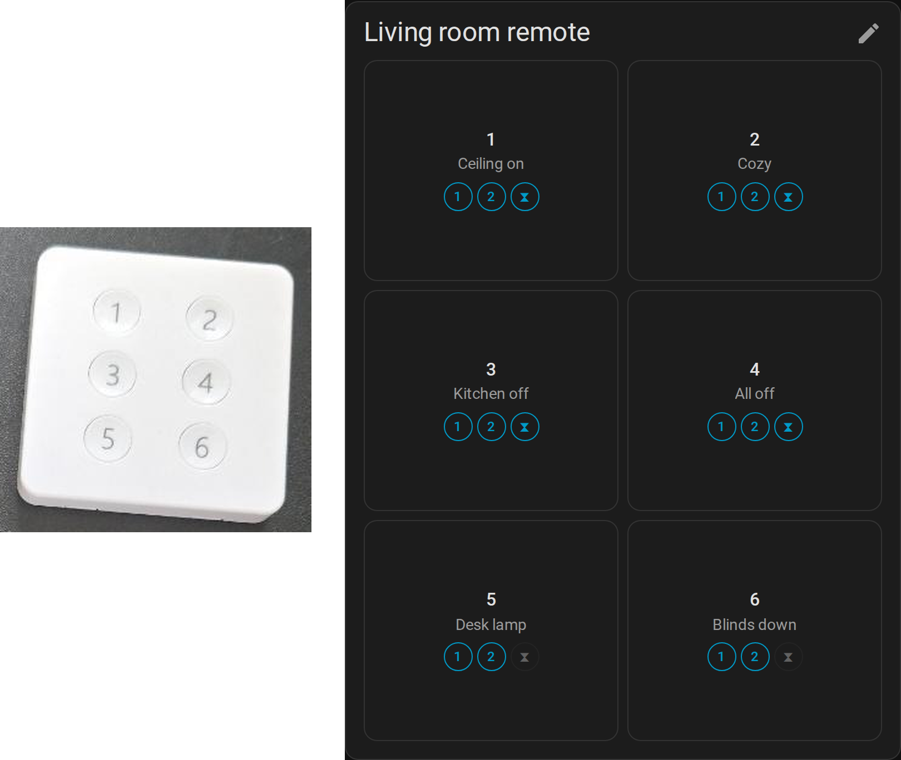
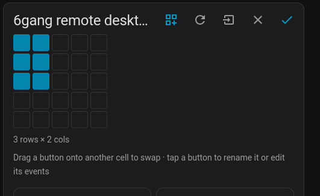
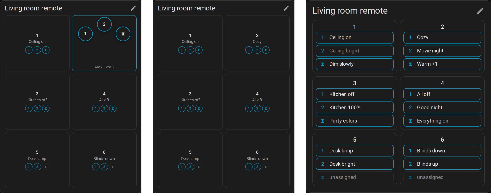
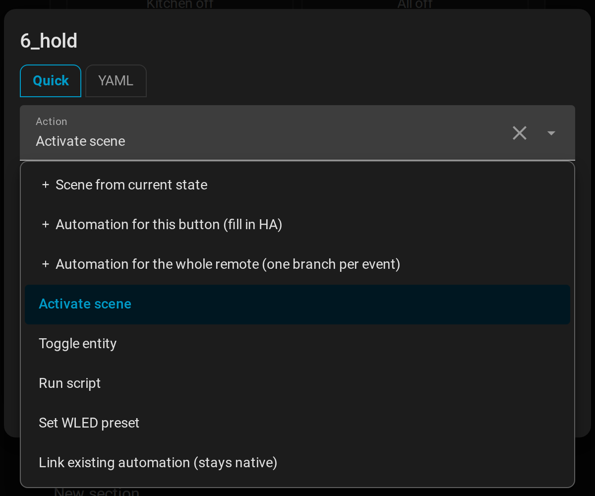

# Remote Mapper for Home Assistant

**Turn any Zigbee / Matter / MQTT remote into a card that looks like the
remote — and assign what each button does right there, on the dashboard.**

No blueprints, no one-automation-per-button, no YAML hunting. Pick the
button, pick the action, done. Everything else (automations, scenes, the
device's quirks) is handled for you.

<!-- screenshot: the card in "normal" mode next to the physical remote -->


## Why

Remotes are the best input device in a smart home and the worst to set up.
Every button × press type is a separate trigger, so a 6-button remote with
single/double/hold is 18 automations — or one giant `choose`. Six months
later nobody remembers what button 4 does.

Remote Mapper gives each remote **one card**, arranged like the real
device, where every button shows what it does and lets you change it.

## What you get

- **A card shaped like the remote.** A Word-style picker sets the grid
  (2×3, 1×4, …); drag buttons into place; rename them. Saved with the
  remote, so every dashboard shows the same layout.

  <!-- screenshot: edit mode with the ⊞ grid picker open -->
  

- **Three ways to use it** (per card, in the card editor):

  | Mode | What you see | What a tap does |
  |---|---|---|
  | **Normal** | one pad per button, marks for single / double / hold | tap = single, double-tap = double, hold = hold — the card *is* the remote |
  | **All visible** | every event of every button as a chip | tap a chip |
  | **Assisted** | one pad per button | press → the button's events fan out inside it, slide onto one and lift (mouse: click, click) |

  <!-- screenshots: the three modes side by side -->
  

- **Assign in seconds.** Tap an event → *Activate scene*, *Toggle entity*,
  *Run script*, *Set WLED preset*… with HA's own pickers. Need more? A
  YAML tab takes the full automation action syntax (`if`, `choose`,
  templates).

  <!-- screenshot: the slot editor, Quick tab -->
  

- **📸 Snapshot to scene.** Set the room the way you like it, press
  *Snapshot* on a button: the current state of the room becomes a scene
  bound to that button. Press again later to update it in place.

- **Real automations when you want them.** Tick *Create as automation* on
  any button: it becomes a native HA automation (traces, the HA editor,
  "related" search). Untick to fold it back into the card. Your choice,
  per button, reversible.

- **Import what you already have.** Existing automations for the remote
  are absorbed into the card; the originals are disabled, never deleted.

- **Appearance.** Colors and pad opacity in the card editor; follows your
  theme and HA's font-size setting out of the box.

## Supported remotes

Anything that reaches Home Assistant as one of:

| Source | Examples |
|---|---|
| **Device triggers** (default) | Zigbee2MQTT and ZHA remotes — Tuya, Aqara, IKEA, Hue, MOES, … |
| **Matter** multi-button | IKEA BILRESA and other Matter remotes exposing one `event.*` per button |
| **Event entity** | any `event.*` entity with `event_types` |
| **Zigbee2MQTT raw topic / generic MQTT** | deCONZ, ESPHome, custom firmware |

With Zigbee2MQTT 2.x every button and press type is known up front (the
device definition is read from `bridge/devices`), so all slots exist right
after setup. Older Z2M or other sources discover actions lazily: press each
button once and Remote Mapper picks them up — on HA start, when you open
the card's edit mode, or with the ↻ button in the header. No restart
needed; new actions are live immediately.

## Install

1. HACS → *Custom repositories* → add this repo as **Integration** → install.
2. Restart Home Assistant.
3. *Settings → Devices & services → Add integration → Remote Mapper*, pick
   the device, press its buttons once.
4. Edit a dashboard → *Add card* → **Remote Mapper Card**. With one remote
   nothing needs configuring.

The card ships with the integration; no separate frontend install. (YAML
dashboards: add the resource
`/hacsfiles/remote_mapper/remote-mapper-card.js` as a module.)

## Card options

Everything below is available in the visual card editor; YAML for
reference:

```yaml
type: custom:remote-mapper-card
entry_id: …               # optional with a single remote
layout: grid              # grid (default) | canvas (free-drag tiles)
display: normal           # normal | all | assisted
assisted_trigger: auto    # assisted: auto (touch→press, mouse→tap) | tap | press
chips_layout: vertical    # all: vertical | horizontal | grid
button_color: "#3f51b5"   # any CSS color; unset = theme
accent_color: ""          # borders, assigned marks, flashes; unset = primary
text_color: ""
button_opacity: 1         # 0.1 – 1, pad background only
```

Themes can set `--remote-mapper-button-color`, `--remote-mapper-accent-color`,
`--remote-mapper-text-color`, `--remote-mapper-border-color`,
`--remote-mapper-button-opacity`.

## Good to know

- **Tapping a pad on the dashboard runs the action** — handy for testing
  from the couch. It is not the physical button event; automations you
  materialized don't fire from it.
- Scenes and automations the integration created are the only ones it will
  ever offer to delete, and it asks first (remembered choice: ask / always /
  never).
- If Zigbee2MQTT renames an action, the button gets a *stale* badge instead
  of silently breaking.

## Contributing

See [DEVELOPMENT.md](DEVELOPMENT.md) for the dev loop, the dockerized test
HA, and releases.
