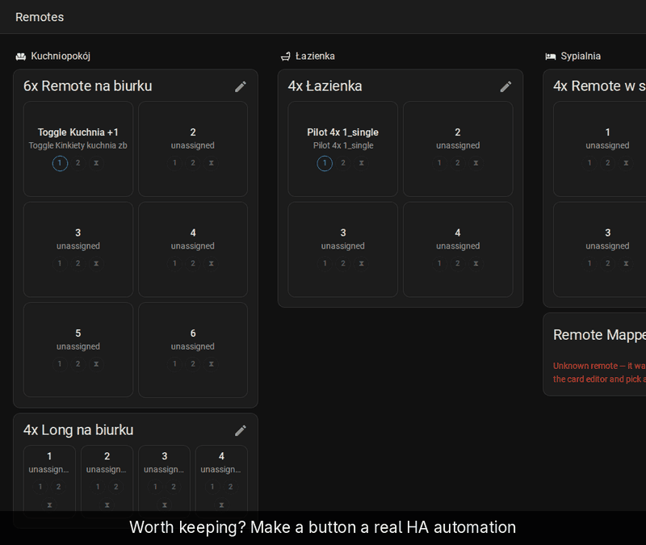
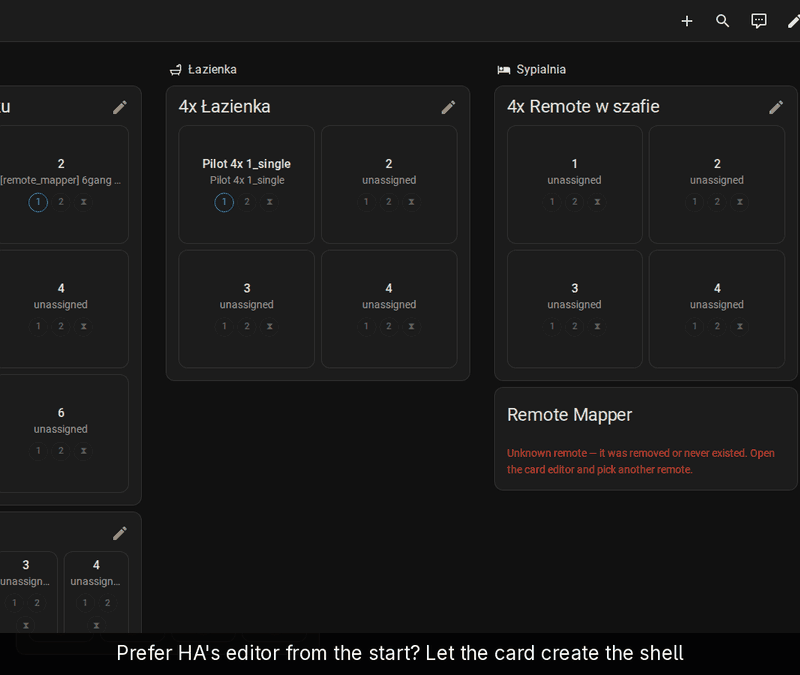

# Automations

Actions assigned in the card run inside Remote Mapper. When you want HA's
traces, the HA automation editor or "related" search for a button, turn it
into a native automation. Either direction is reversible.

## One button as an automation

[Full-size recording](../demo/full/10-create-as-automation.gif)

1. On the card, click the pencil, tap the button, and click the pencil next
   to an event.
2. Pick the *Action* as usual (here *Toggle entity* and a light).
3. Tick *Create as automation (editable/traceable in HA)* and *Save*.
4. The event's row now shows the automation. Its icon opens it in HA's
   automation editor.

The automation is named `[remote_mapper] <remote> · <event>` and comes with
the trigger and action filled in. Edit it in HA from here on: the editor
copy is the one that counts. Untick the box later to fold the action back
into the card.

## One automation for the whole remote

[Full-size recording](../demo/full/11-automation-shell.gif)

Prefer the blueprint look, one automation with a branch per button?

1. Click the pencil, tap any button, and click the pencil next to an event.
2. In *Action*, pick *＋ Automation for the whole remote (one branch per
   event)*.
3. Click *Create & open in HA*.

HA's editor opens on the new automation. It has one trigger per event of
the remote and a `choose` block with one branch per event. Fill the branches
there. Back on the card every button shows *empty branch* until its branch
has actions.

Actions you had already built in the card move into their branch. Buttons
that have their own automation stay as they are. Clearing a button in the
card removes its branch.

For a single button, *＋ Automation for this button (fill in HA)* does the
same with one trigger and an empty action list.

## Next

- [Existing automations](existing-automations.md): bring in automations you
  wrote before installing Remote Mapper.
