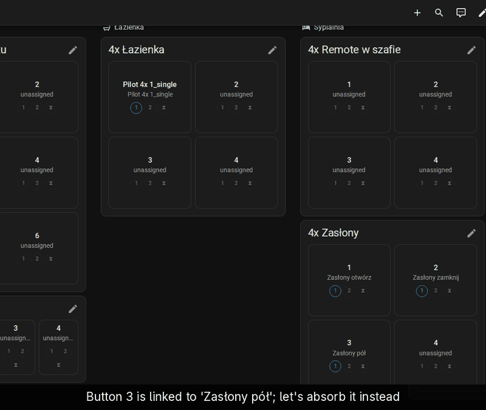
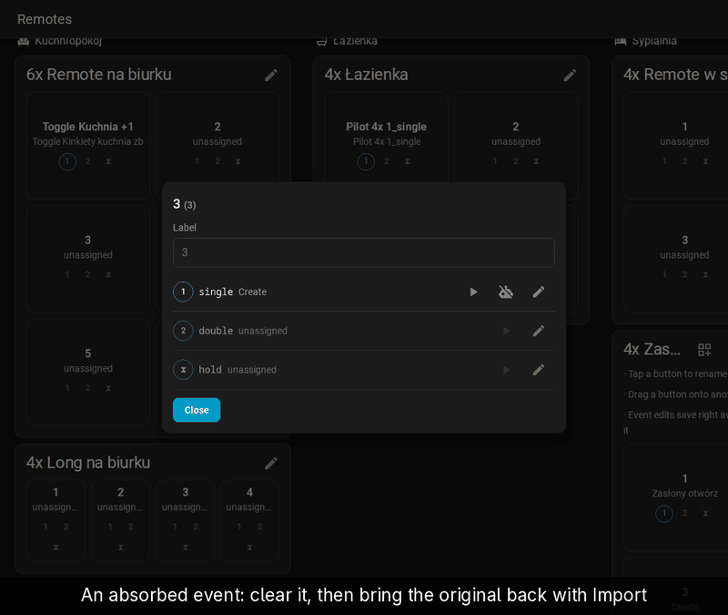
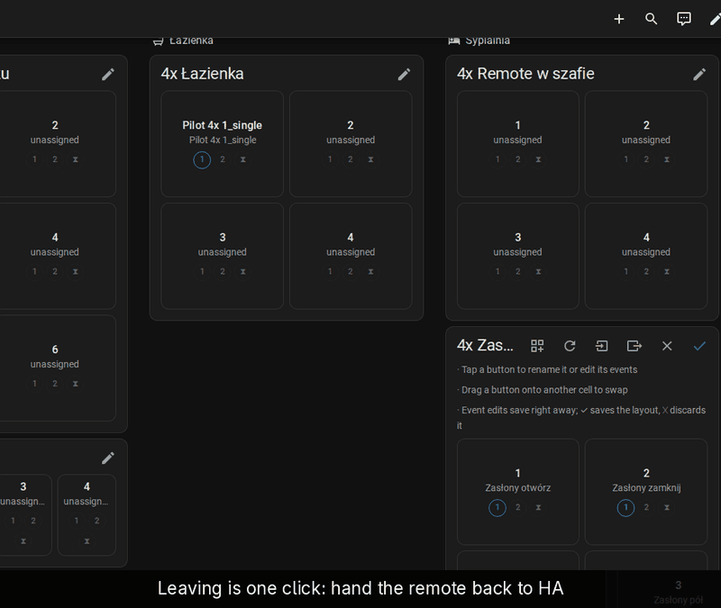

# Existing automations

Automations you wrote before installing Remote Mapper can stay as they are.
Import finds every automation triggered by the remote and puts each on its
button, in one of two modes:

- **Link** keeps the automation native and enabled. The card shows it and
  opens it in HA's editor.
- **Absorb** copies its actions into the card and disables the original.
  The original is never deleted.

## Link

[Full-size recording](../demo/full/06-import-link.gif)

1. On the card, click the pencil, then the import icon (*Import existing
   automations*).
2. Each automation found gets a row with its event. Leave the mode on *link
   (keep native)*.
3. Click *Apply*. The buttons show the automations by name.
4. Tap a button: the linked event shows whether the automation is on, a
   button to run it, and one to open it in HA's automation editor.

## Absorb

[Full-size recording](../demo/full/07-import-absorb.gif)

Choose *absorb* in the import dialog, or switch a linked event later:

1. Click the pencil, tap the button, and click the pencil next to the linked
   event.
2. Untick *Keep linked to the automation (untick to absorb into the card)*.
3. *Save*.

The actions now live in the card. The event's row shows a crossed-out robot
icon: the original is still in HA, disabled.

## Undo an absorb

[Full-size recording](../demo/full/09-clear-then-reimport.gif)

1. Click the pencil, tap the button, open the absorbed event and click
   *Clear*. Confirm. The event goes back to *not set*; the original
   automation stays in HA, still disabled.
2. Open *Import existing automations* again. Only the cleared event's row is
   ticked. Rows for events that already have an action are marked
   *(overwrites slot)* and left alone unless you tick
   *Overwrite already-assigned slots*.
3. Click *Apply*. The event is linked to the original again, and the
   original is switched back on.

## Hand the remote back

[Full-size recording](../demo/full/08-hand-back.gif)

To stop using Remote Mapper for a remote without losing anything:

1. Click the pencil, then the hand-back icon (*Hand this remote back to
   HA…*).
2. The dialog lists what happens to each event: imported originals are
   re-enabled, linked automations are left untouched, automation-backed
   events keep their automation under a plain name, and snapshot scenes
   stay as ordinary scenes.
3. Events built in the card are converted to plain automations while the
   checkbox for them is ticked. Untick it to drop them instead.
4. Click *Hand back*.

The remote's layout and mapping are removed. Its automations and scenes
stay in *Settings → Automations & scenes*. Deleting the integration from
*Settings → Devices & services* re-enables imported originals the same way.
