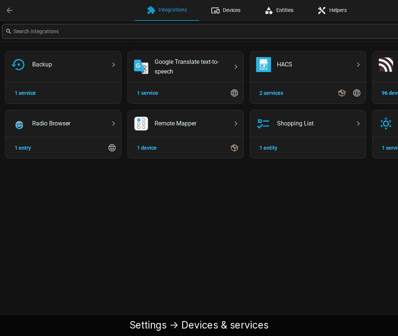
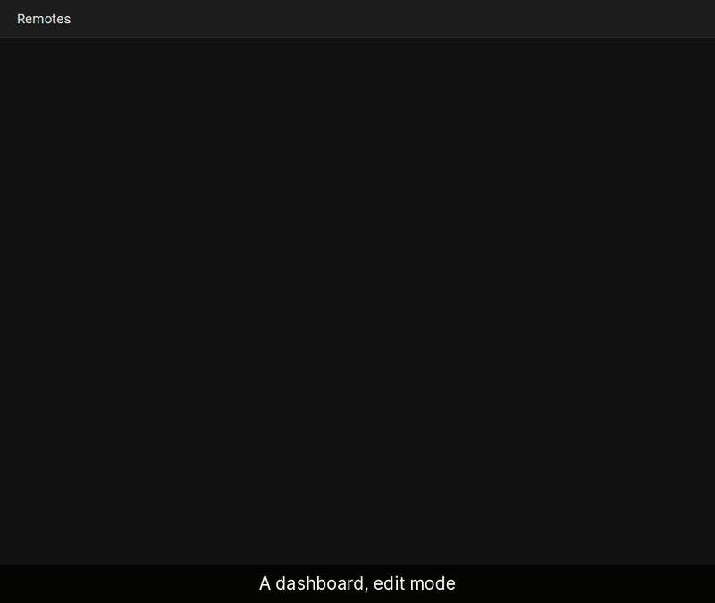

# Getting started

From a remote Home Assistant already knows about to a card with a working
button, in three steps. Install the integration first (see
[Install](../../README.md#install)).

## 1. Add the remote

[Full-size recording](../demo/full/01-add-remote.gif)

1. *Settings → Devices & services → Add integration*, search for
   **Remote Mapper**.
2. Pick the source. For a Zigbee2MQTT or ZHA remote that is
   *Device with triggers (Zigbee2MQTT, ZHA, …) — recommended*. The other
   sources are listed under [Supported remotes](../../README.md#supported-remotes).
3. *Pick device*: search for the remote and select it.
4. *Button actions* lists the action ids found on the device (`1_single`,
   `1_hold`, …). Check them and submit.
5. *Name and assign*: rename the remote and pick an area if you like, then
   finish.

With Zigbee2MQTT 2.x every action is found up front. Older Z2M only reports
an action after its button has been pressed once: press each button and
gesture, tick *Probe again* and submit to refresh the list.

## 2. Add the card

[Full-size recording](../demo/full/02-add-card.gif)

1. Open a dashboard, enter edit mode and click *Add card*.
2. Switch to the *By card* tab and search **Remote Mapper**. The card does
   not appear under *By entity*.
3. Select *Remote Mapper Card*.
4. Pick the *Remote*. The preview on the right updates right away.
5. Set a *Title* if you want one, then *Save* and *Done*.

The first time the card shows, four tips walk through its header buttons.

## 3. Assign an action

[Full-size recording](../demo/full/03-assign-action.gif)

1. Click the pencil at the top right of the card (*Edit layout & slots*).
2. Tap a button. Its panel shows a *Label* field and one row per event
   (*single*, *double*, *hold*), each *not set* for now.
3. Rename the button in *Label* if you like.
4. Click the pencil next to an event, e.g. *single*.
5. Pick an *Action*, e.g. *Toggle entity*, then the *Entity*. The *Name*
   fills itself in. *Save*.
6. Close the panel and click ✓ to leave edit mode.

The event is saved as soon as you click *Save* in its editor. The ✓ and ✗ in
the card header only save or discard layout changes (labels, button order).

Tap the pad on the dashboard to test the action from your seat. The physical
button now does the same.

## Next

- [Layout and looks](layout-and-looks.md): shape the card like the remote.
- [Scenes](scenes.md): bind a button to the room's current state.
