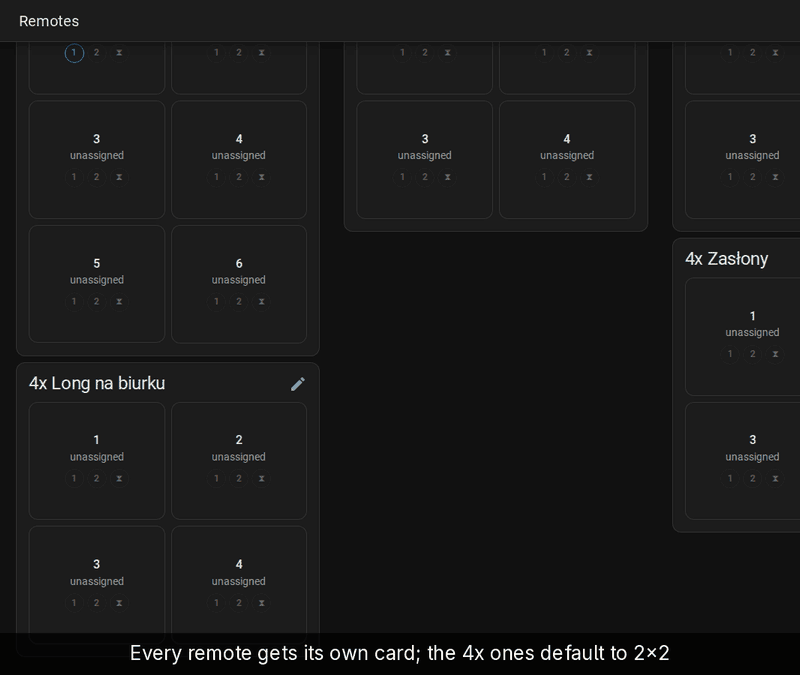
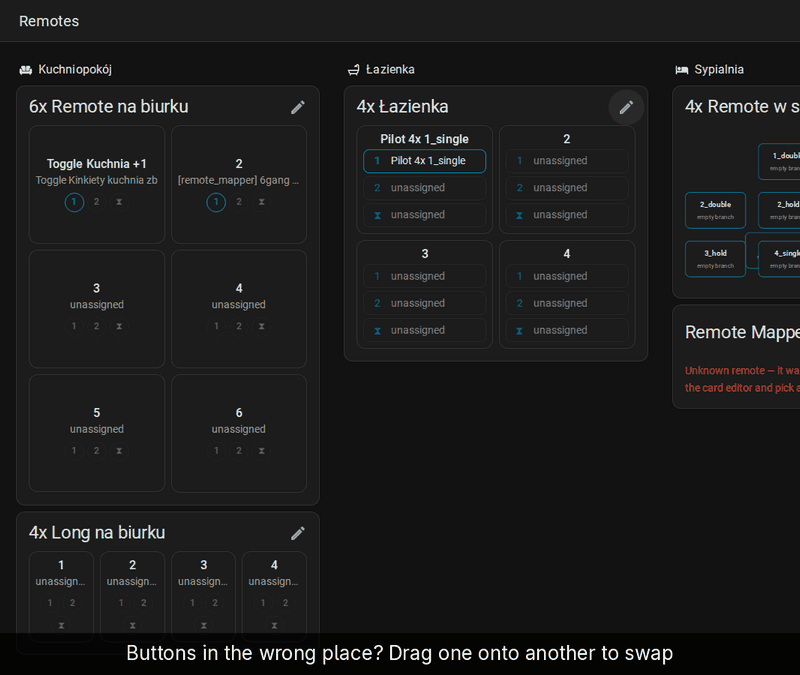
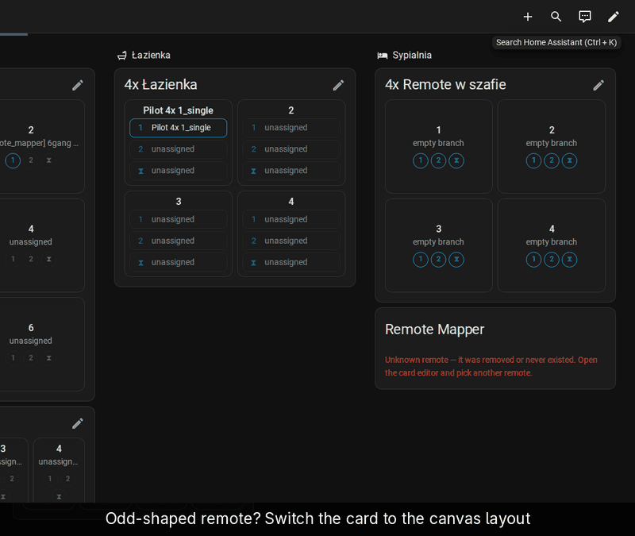
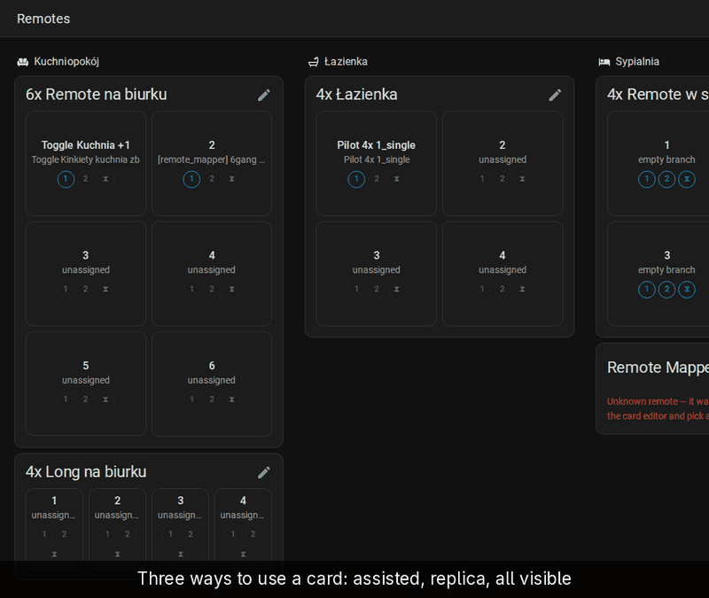
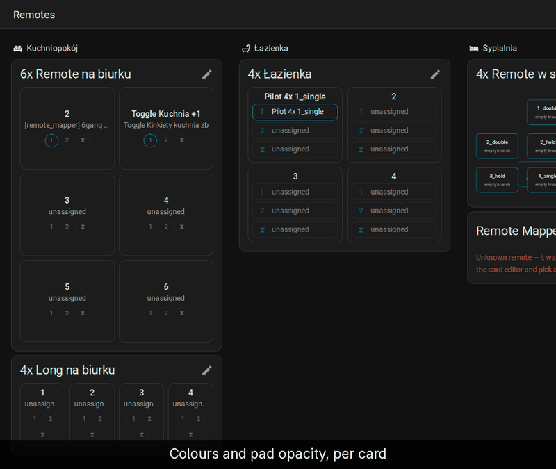

# Layout and looks

Shape the card like the physical remote, choose how taps work, and set its
colours. The grid shape and button order are saved with the remote, so every
dashboard showing it matches. Display mode and colours are per card.

## Grid shape

[Full-size recording](../demo/full/04-layout.gif)

1. Click the pencil on the card (*Edit layout & slots*).
2. Click the grid icon (*Grid shape (rows × columns)*).
3. Hover the picker to preview a shape and click it, e.g. 1 × 4. The card
   re-flows right away.
4. Click ✓ (*Save layout*).

## Swap buttons

[Full-size recording](../demo/full/17-drag-swap.gif)

1. Click the pencil on the card.
2. Drag a button onto another cell. The two swap places.
3. Click ✓ to save the order.

## Canvas layout

[Full-size recording](../demo/full/13-canvas-layout.gif)

For a remote whose buttons don't sit on a grid, such as a round dial:

1. Edit the dashboard and open the card's configuration.
2. Set *Layout* to *Canvas — free placement, one tile per event*. *Save*, then *Done*.
3. Click the pencil on the card.
4. Drag a tile. Its position and size show while you drag.
5. Select a tile and use the arrow pad to nudge it. The centre button
   switches the step between 1 unit and one grid cell.
6. Click ✓ to save.

## Display mode

[Full-size recording](../demo/full/12-display-modes.gif)

1. Edit the dashboard and open the card's configuration.
2. Pick a *Display mode*:
   - *Assisted* (default): press a button, then pick the event.
   - *Replica*: tap, double-tap and hold like the physical remote.
   - *All visible*: every event of every button as a chip.
3. With *All visible*, choose how the chips are laid out under *Event
   chips* (vertical list, compact icons, rotated spines, …).
4. *Save*, then *Done*.

## Colours

[Full-size recording](../demo/full/18-colours.gif)

1. Edit the dashboard and open the card's configuration.
2. Turn on the switch next to *Button color* and pick a colour. The preview
   updates as you pick.
3. Lower *Button opacity* to tint the pads. It affects the pad background
   only, so the text stays readable.
4. *Save*, then *Done*.

With the switch off, the card follows your HA theme. The YAML equivalents
are under [Card options](../../README.md#card-options).
