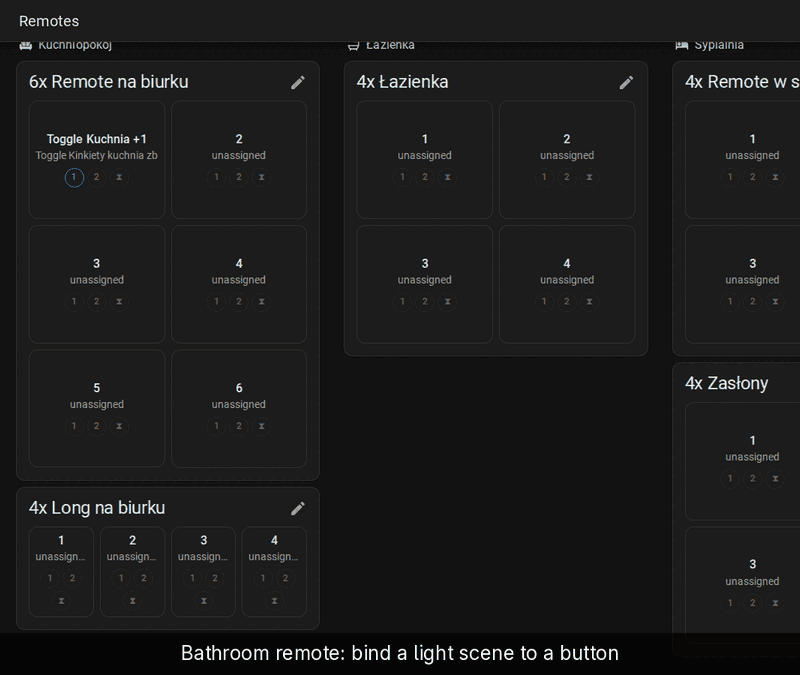
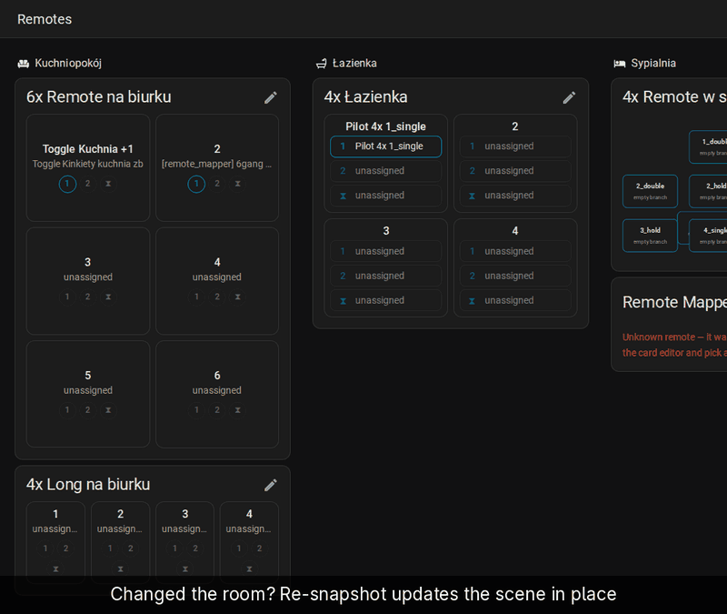

# Scenes

Set the room the way you like it, then store that state as a scene bound to
a button. No scene editor, no entity-by-entity attribute lists.

## Scene from current state

[Full-size recording](../demo/full/05-scene-capture-clean.gif)

1. Set the lights (and anything else) the way the button should leave them.
2. On the card, click the pencil, tap the button, and click the pencil next
   to an event.
3. In *Action*, pick *＋ Scene from current state*.
4. Under *Entities to capture*, use *Add entity* for each entity the scene
   should include.
5. Optional: turn on *Remember these as this remote's default*. A later
   capture on this remote with no entities picked uses this list.
6. Click *Capture*.

The event now activates a new scene holding those entities' current states.
Its row gets three icons: run the scene, open it in HA's scene editor, edit
it in the card.

## Re-snapshot

[Full-size recording](../demo/full/14-re-snapshot.gif)

Changed your mind about the brightness? Set the room again, then:

1. Click the pencil, tap the button, and click the pencil next to the event.
2. Click *Re-snapshot*.

The scene keeps its id and its entity list and takes the entities' current
states. Anything else that uses the scene picks up the change too.

## Next

- [Automations](automations.md): when a button needs conditions or several
  steps, give it a native HA automation.
